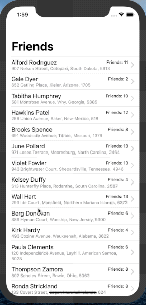

# Friends

**Days 60 & 61 - Challenge app: https://www.hackingwithswift.com/guide/ios-swiftui/5/3/challenge**



#### Technologies used:
- SwiftUI
- URLSession 
- JSON Decoding / Codable
- List/ForEach with Hashable data structure
- NavigationView/Link

### Day 60

It’s time for you to build an app from scratch, and it’s a particularly expansive challenge today: your job is to use URLSession to download some JSON from the internet, use Codable to convert it to Swift types, then use NavigationView, List, and more to display it to the user.

Your first step should be to examine the JSON. The URL you want to use is this: https://www.hackingwithswift.com/samples/friendface.json – that’s a massive collection of randomly generated data for example users.

As you can see, there is an array of people, and each person has an ID, name, age, email address, and more. They also have an array of tag strings, and an array of friends, where each friend has a name and ID.

How far you implement this is down to you, but at the very least you should:

Fetch the data and parse it into User and Friend structs.
Display a list of users with a little information about them.
Create a detail view shown when a user is tapped, presenting more information about them.
Where things get more interesting is with their friends: if you really want to push your skills, think about how to show each user’s friends on the detail screen.

For a medium-sized challenge, show a little information about their friends right on the detail screen. For a bigger challenge, make each of those friends tappable to show their own detail view.

### Day 61 - Add Core Data challenge

#### Adding Core Data to existing project
1. Add the .xcdatamodel: File > New > Data Model (unde Core Data section)
2. Copy/Paste the AppDelegate.swift Core Data boiler plate from a project which already had CoreData checked - at the project creation phase. Eg:

```Swift
// MARK: - Core Data stack

    lazy var persistentContainer: NSPersistentCloudKitContainer = {
        /*
         The persistent container for the application. This implementation
         creates and returns a container, having loaded the store for the
         application to it. This property is optional since there are legitimate
         error conditions that could cause the creation of the store to fail.
        */
        let container = NSPersistentCloudKitContainer(name: "Users")
        container.loadPersistentStores(completionHandler: { (storeDescription, error) in
            if let error = error as NSError? {
                // Replace this implementation with code to handle the error appropriately.
                // fatalError() causes the application to generate a crash log and terminate. You should not use this function in a shipping application, although it may be useful during development.
                 
                /*
                 Typical reasons for an error here include:
                 * The parent directory does not exist, cannot be created, or disallows writing.
                 * The persistent store is not accessible, due to permissions or data protection when the device is locked.
                 * The device is out of space.
                 * The store could not be migrated to the current model version.
                 Check the error message to determine what the actual problem was.
                 */
                fatalError("Unresolved error \(error), \(error.userInfo)")
            }
        })
        return container
    }()

    // MARK: - Core Data Saving support

    func saveContext () {
        let context = persistentContainer.viewContext
        if context.hasChanges {
            do {
                try context.save()
            } catch {
                // Replace this implementation with code to handle the error appropriately.
                // fatalError() causes the application to generate a crash log and terminate. You should not use this function in a shipping application, although it may be useful during development.
                let nserror = error as NSError
                fatalError("Unresolved error \(nserror), \(nserror.userInfo)")
            }
        }
    } 
```

3. Modify the name of the Container to match the name of the .xcdatamodeld file, eg for Users.xcdatamodeld:

```Swift
let container = NSPersistentCloudKitContainer(name: "Users") 
```

4. Add import CoreData to AppDelegate

5. Modify SceneDelegate.swift, in func scene(_ scene: UIScene, willConnectTo session:) add:
```Swift
let context = (UIApplication.shared.delegate as! AppDelegate).persistentContainer.viewContext
```

6. Add the environment modifier to ContentView():
```Swift
let contentView = ContentView().environment(\.managedObjectContext, context)
```

#### onAppear
I'm checking if the data was already stored inside the CoreData DB, before fetching.
For testing purposes, I am deleting all data on each launch, in SceneDelegate.swift:

```Swift
let fetch = NSFetchRequest<NSFetchRequestResult>(entityName: "SavedUsers")
let request = NSBatchDeleteRequest(fetchRequest: fetch)
_ = try? context.execute(request)

let fetch2 = NSFetchRequest<NSFetchRequestResult>(entityName: "Friends")
let request2 = NSBatchDeleteRequest(fetchRequest: fetch)
_ = try? context.execute(request) 
```

#### Intermediary Codable structs
To get the data from the network JSON into CoreData I am first decoding into my own Codable structs. And then I'm going through each item and creating a new row in the DB:

```Swift
 let url = URLRequest(url: URL(string: "https://www.hackingwithswift.com/samples/friendface.json")!)
                URLSession.shared.dataTask(with: url) { (data, resp, error) in
                    let decoder = JSONDecoder()
                    if let userData = data {
                        DispatchQueue.main.async {
                            do {
                                self.userList.users = try decoder.decode([User].self, from: userData)
                                
                                var counter = 0
                                
                                for user in self.userList.users {
                                    counter += 1
                                    let newUser = SavedUsers(context: self.moc)
                                    newUser.id = user.id
                                    newUser.name = user.name
                                    newUser.age = user.age
                                    newUser.address = user.address
                                    newUser.about = user.about
                                    for friend in user.friends {
                                        let newFriend = Friends(context: self.moc)
                                        newFriend.id = friend.id
                                        newFriend.name = friend.name
                                        newFriend.friendOf = newUser
                                    }
                                }
                                
                                if self.moc.hasChanges {
                                    try? self.moc.save()
                                    print("Core Data saved, \(counter)")
                                }
                            } catch {
                                print(error.localizedDescription)
                            }
                        }
                    }
                }.resume() 
```

#### @FetchRequest on DetailView()
Initially I tried to use a @FetchRequest property on the DetailView, however the user.name cannot be used as it's not initialized yet:

```Swift
var user: SavedUsers

@FetchRequest(entity: Friends.entity(),
              sortDescriptors: [],
              predicate: NSPredicate(format: "friendOf.name == %@", user.name)
) var friends: FetchedResults<Friends> 
```

Instead we have to use a custom view - in order to pass the user.name after it is initialized.
I reused FilteredList from the previous (CoreDataExperiments) project: 

```Swift
FilteredList(predicate: .equals,
             filterKey: "friendOf.name",
             filterValue: user.name ?? "",
             sortKey: "name",
             sortAsc: true) { (friends: FetchedResults<Friends>) in
                List {
                    ForEach(friends, id:\.self) { friend in
                        NavigationLink(destination: DetailView(user: self.user)) {
                            Text(friend.name ?? "")
                        }
                    }
                }
} 
```

